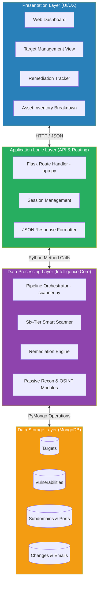
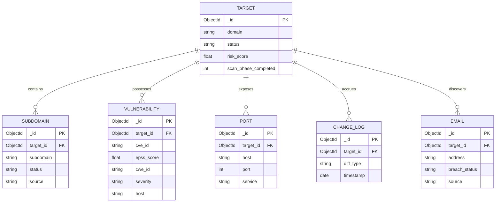
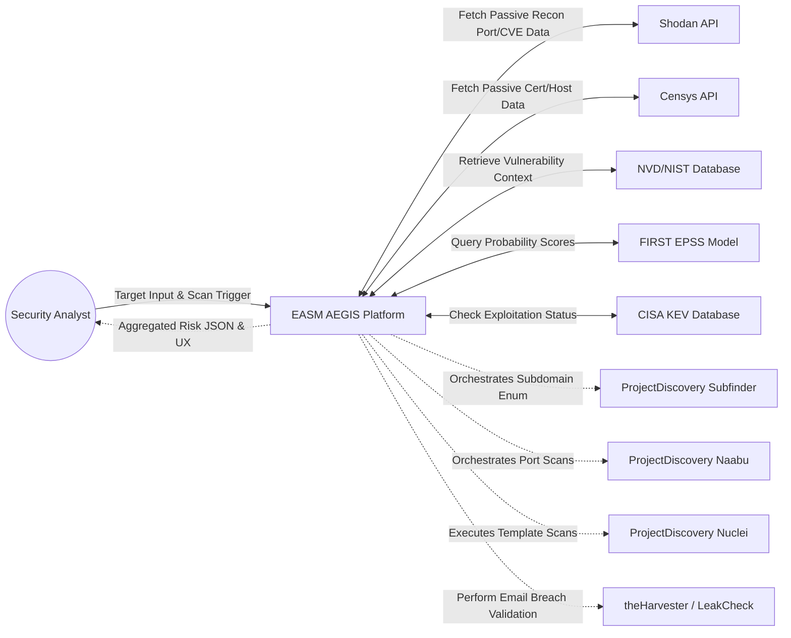
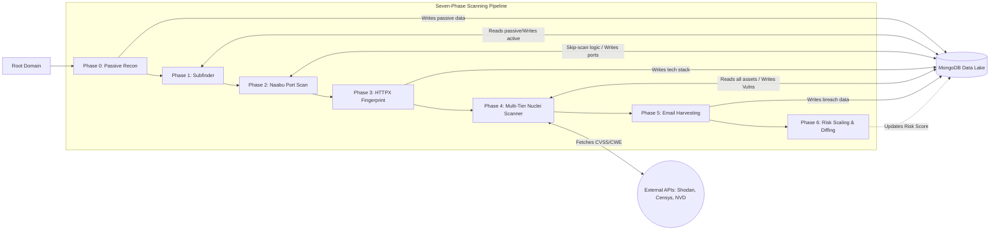
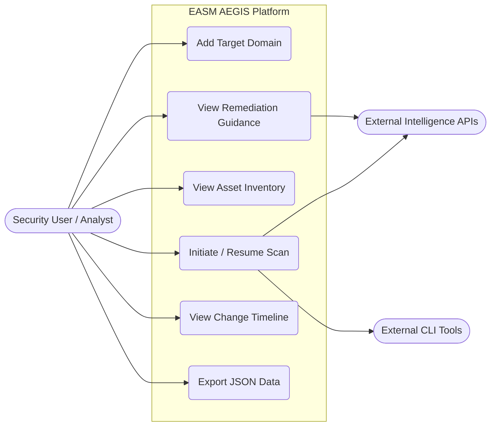
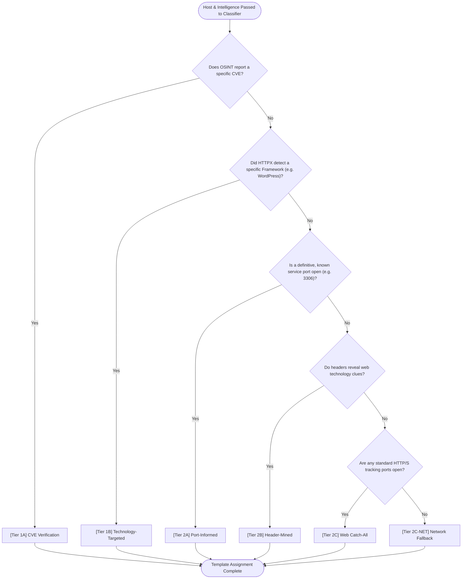
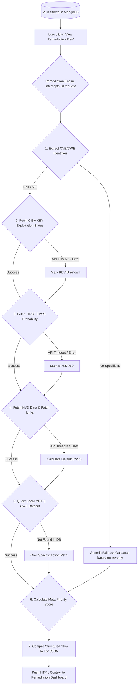
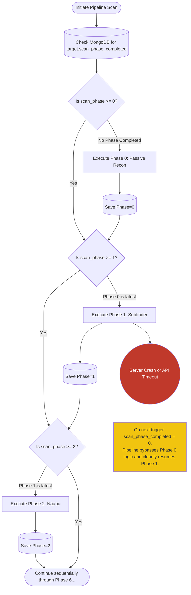
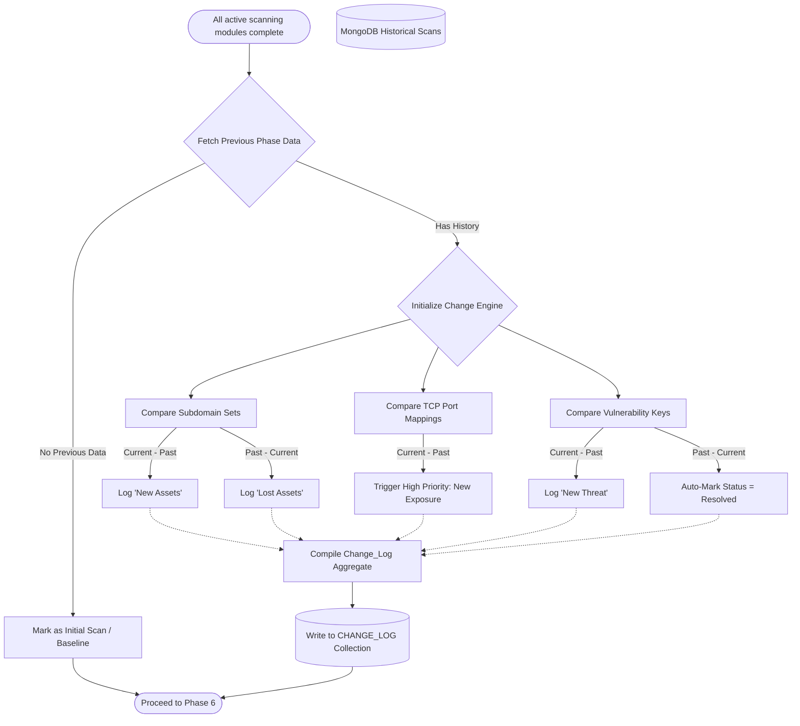
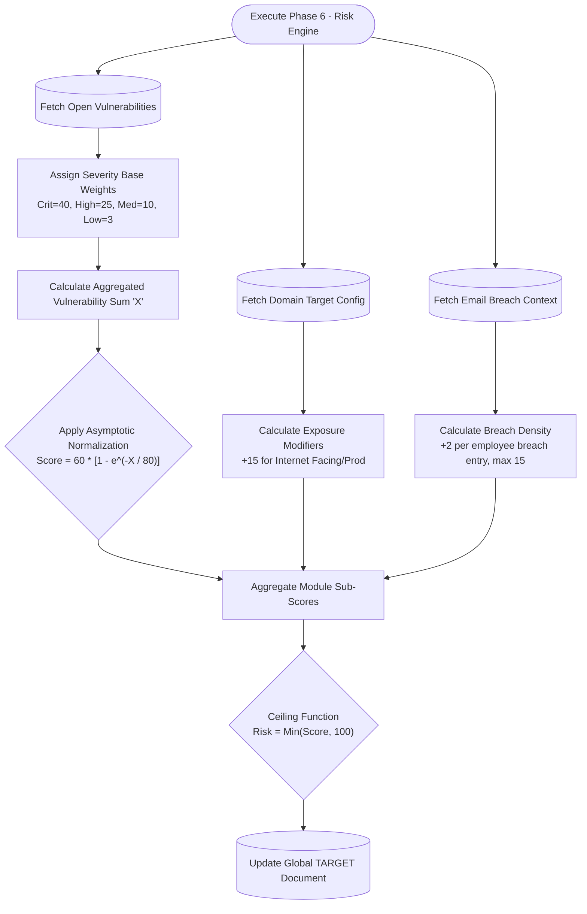

# EASM AEGIS - Comprehensive Mermaid Diagrams

This document contains the exact 8 architectural diagrams required for your report, written in standard Mermaid.js syntax.

*Tip: Paste each code block into the [Mermaid Live Editor](https://mermaid.live/) to generate high-resolution PNGs for your submission.*

---

## 1. System Architecture Diagram
*Four-layer modular architecture showing Presentation -> Application -> Data Processing -> Data Storage.*



---

## 2. MongoDB Entity Relationship Diagram (ERD)
*Maps the Target document to the 5 other primary collections discovered during intelligence gathering.*



---

## 3. Data Flow Diagram - Level 0 (Context)
*Represents EASM AEGIS as the central Intelligence Hub interacting with human actors, external Intelligence APIs, and external CLI binaries.*



---

## 4. Data Flow Diagram - Level 1 (Pipeline)
*Detailed 7-phase structural state machine describing how unstructured target data transforms into a final Logarithmic Risk Score.*



---

## 5. Use Case Diagram
*Core interactions executed by the standard Security Analyst/User against the ecosystem.*



---

## 6. Six-Tier Smart Scanning Decision Tree Flowchart
*The architectural decision matrix that assigns discovered hosts to specific Nuclei vulnerability bins to drastically reduce scan runtime.*



---

## 7. Remediation Enrichment Pipeline Flowchart
*Maps the robust sequence of external API validation checks, ensuring failures silently fallback to simpler severity logic seamlessly.*



---

## 8. Seven-Phase Scanning Pipeline with Resumability
*Shows how the pipeline's checkpoints prevent repeating intense scanning jobs when network failures or timeouts occur.*



---

## 9. Flowchart — Change Detection Engine
*Set-difference mathematical sequence demonstrating how the backend auto-resolves patched vulnerabilities and maps new shadow IT.*



---

## 10. Flowchart — Logarithmic Risk Scoring Algorithm
*A mathematical flowchart illustrating how the pipeline processes the final security grade, severely penalizing the first few critical vulnerabilities but compressing subsequent ones to prevent score inflation over 100.*



---

## 11. Flowchart — Priority Score Calculation Algorithm
*Maps the conditional mathematical flow for triaging an individual vulnerability based on severity, exploitability, and exposure to guarantee a dynamic 0-100 severity grade.*

```mermaid
flowchart TD
    Start([Calculate Priority Score for Vulnerability])
    Init[Base Priority Score = 0]
    
    Start --> Init
    
    Init --> F1{1. Base Severity?}
    F1 -->|Critical| Add35[+ 35 Points]
    F1 -->|High| Add25[+ 25 Points]
    F1 -->|Medium| Add15[+ 15 Points]
    F1 -->|Low| Add8[+ 8 Points]
    
    Add35 --> F2
    Add25 --> F2
    Add15 --> F2
    Add8 --> F2
    
    F2[2. CVSS Score Multiplier] --> CVSS[+ Min(CVSS_Score * 2, 20 Max)]
    
    CVSS --> F3[3. EPSS Likelihood Multiplier]
    F3 --> EPSS[+ Min(EPSS_Percent * 25, 25 Max)]
    
    EPSS --> F4{4. Actively Exploited?}
    F4 -->|Yes| KEV[+ 15 Points from CISA KEV]
    F4 -->|No| F5
    KEV --> F5
    
    F5{5. Asset Exposure}
    F5 -->|Internet Facing/Prod| Exp[+ 5 Points]
    F5 -->|Internal| Total
    Exp --> Total
    
    Total[Sum All Modifier Factors] --> MathCeil{"Ceiling Function<br/>Final_Priority = Min(Total, 100)"}
    
    MathCeil --> Done([Return Final Priority Score])
```
