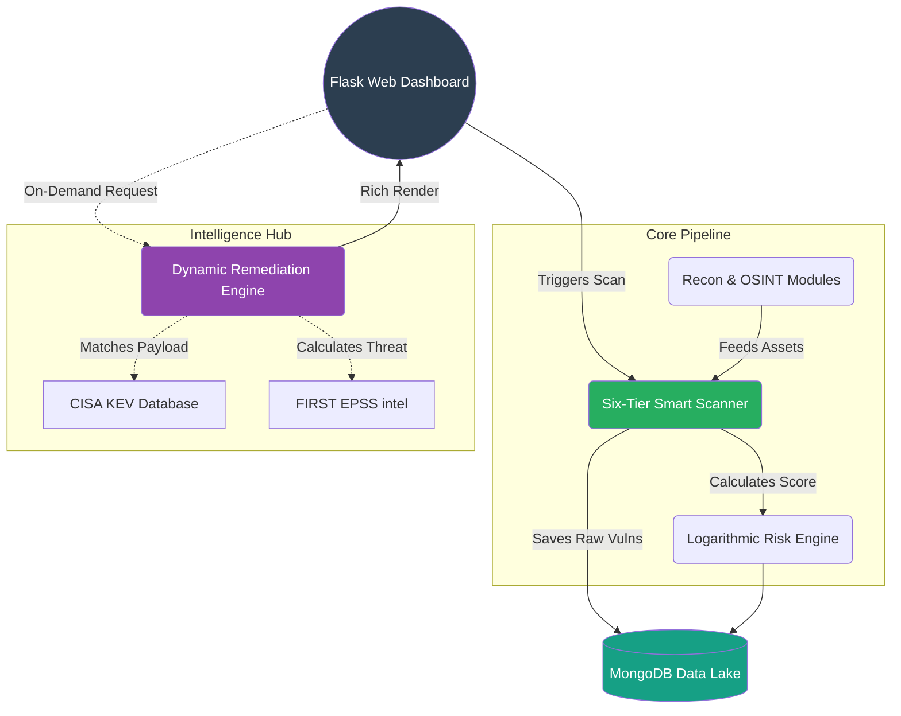

# EASM AEGIS - Final Project Report Aid

This document provides a highly detailed, structured overview of the final state of the EASM AEGIS platform. It is designed to aid in the writing of your final academic or professional project report, ensuring all technical achievements, architectural decisions, and innovations are captured.

---

## A. Major Upgrades, New Features, and Architectural Changes (Post-Interim)

### Planned vs. Implemented
- **Implemented:** **Six-Tier Smart Scanning Engine.** Instead of blindly throwing all Nuclei templates at a target, the engine dynamically classifies assets and only runs relevant templates (e.g., WordPress exploits only against a confirmed WordPress asset), saving massive amounts of compute time.
- **Implemented:** **Advanced Remediation Engine (The "How To Fix" Hub).** We successfully integrated NVD (CVSS), CISA KEV (Known Exploited Vulnerabilities), EPSS (Exploit Prediction Scoring System), and the MITRE CWE API to auto-generate incredibly detailed remediation plans.
- **Implemented:** **Logarithmic Risk Scoring.** Transitioned from a naive linear additive model to a logarithmic model with horizontal asymptotes. This prevents score inflation on massive targets and ensures the score gracefully scales between 0-100 regardless of size.
- **Implemented:** **Email Harvesting & Breach Tracking.** Integrated `theHarvester`, `Hunter.io`, and `Phonebook.cz` into the standard pipeline.
- **Implemented:** **Passive OSINT Reconnaissance.** Integrated active queries for *Shodan*, *Censys*, and *WHOIS* data to catch expired SSL certificates, parked domains, and anomalous host data before active scanning begins.
- **Deprioritized / Removed:** PDF automated report generation. The frontend UI became so rich (via the Remediation Dashboard and Asset Breakdown views) that offline PDFs were deemed redundant for the current scope.
- **Removed:** Redundant bulk classification scripts that clustered the codebase, favoring real-time API flow.

---

## B. Current System Architecture (As-Built)

### Pipeline Phases (Expanded to 7 core stages)
1. **Phase 0: Passive Reconnaissance.** Shodan, Censys, and WHOIS lookups to define the initial asset footprint passively.
2. **Phase 1: Subdomain Discovery.** Utilizing `subfinder` to map the external perimeter.
3. **Phase 2: Port & Service Discovery.** Utilizing `naabu` to find open ports and raw services.
4. **Phase 3: Technology Fingerprinting.** Checking HTTP headers and responses to detect underlying technologies.
5. **Phase 4: Multi-Tiered Vulnerability Scanning (Nuclei).** Running the Six-Tier Smart Engine.
6. **Phase 5: Email Harvesting & Risk Scoring.** Aggregating `Hunter.io` / `theHarvester` data and calculating the final Logarithmic Risk Score.
7. **Phase 6: Change Tracking.** Diffing the current scan against previous scans to alert on new open ports or discovered subdomains.

### Six-Tier Scanning Logic 
The engine categorizes targets to optimize Nuclei templates:
- **Tier 1A (Confirmed Exploits):** High-confidence CVEs based on perfectly matched technology stacks.
- **Tier 1B (Technology Specific):** Default credentials and config templates matching the specific framework.
- **Tier 2A (Service/Port):** Templates mapped to specific exposed ports (e.g., 22/SSH, 3306/MySQL).
- **Tier 2B (Header/Config):** Checking for missing HTTP security headers.
- **Tier 2C (Broad Routing):** Catch-all default templates if fingerprinting fails.
- **Tier 2C-NET:** Low-level network and DNS anomalies.

### Remediation Engine
The engine is completely decoupled from the scanner. Vulnerabilities are stored raw in the database and **enriched on the fly** when requested by the UI. It cross-references the `cwe_id` and `cve_id` with local knowledge bases, EPSS threat intel, and CISA KEV datasets to build the plan.

### Database Schema (MongoDB)
- `targets`: Root domains and configuration.
- `subdomains`: Discovered hosts.
- `ports_services`: Open ports, banner grabbing results.
- `http_assets`: Web server details, SSL certificates, title tags.
- `vulnerabilities`: Raw findings from Nuclei.
- `scans`: Historical records of pipeline execution and metrics.
- `changes`: Deltas between historical scans.
- `emails`: Employee emails and breach context.
- `passive_recon`: Cached Shodan/Censys data.

### Frontend / UI Subsystems
- **Dashboard:** High-level metrics, donut charts, and the global security grade.
- **Asset Breakdown:** An interactive, hierarchal view of subdomains dynamically categorized.
- **Vulnerabilities Detail:** A minimalist, highly professional card view showing raw CVSS constraints and generic fix data.
- **Remediation Plan:** A dedicated view grouping targeted "How to Fix" operations cleanly (emojis and code blocks removed for professional aesthetic).

---

## C. Technology Stack (Final)

**Core Languages & Frameworks:**
- Backend: Python 3.10+
- Web Framework: Flask (Werkzeug)
- Frontend: HTML5, Vanilla JavaScript, Bootstrap 5, Jinja2 Templating
- Database: MongoDB (PyMongo)

**Security Binaries & OSINT Orchestration:**
- `subfinder` (ProjectDiscovery)
- `naabu` (ProjectDiscovery)
- `nuclei` (ProjectDiscovery)
- `theHarvester` (Kali Linux toolkit)

**API Integrations:**
- NVD / NIST CVE APIs
- CISA KEV (Known Exploited Vulnerabilities list)
- FIRST EPSS API (Exploit Prediction)
- Shodan API & Censys API
- Hunter.io API

---

## D. Code Structure (File Tree)

```text
easm_code/
├── app.py                      # Global entry point and UI Router
├── config.py                   # Environment and Global settings
├── requirements.txt
├── docker-compose.yml          # Container configuration
├── core/                       # The Brain
│   ├── pipeline.py             # Orchestrates the 7 phases
│   ├── smart_scanner.py        # Six-Tier classification logic
│   ├── remediation_engine.py   # Aggregates CISA/EPSS intelligence
│   ├── cve_enricher.py         # Parses/translates technical exploit strings
│   ├── risk_scorer.py          # The Logarithmic mathematical engine
│   ├── email_harvester.py      # theHarvester / hunter.io logic
│   ├── nuclei.py               # Nuclei subprocess wrapper
│   ├── subfinder.py            # Subfinder subprocess wrapper
│   ├── naabu.py                # Naabu port scanner wrapper
│   ├── shodan_recon.py         # Shodan API client
│   └── censys_recon.py         # Censys API client
├── routes/                     # Blueprint API Controllers
│   ├── scans.py
│   ├── targets.py
│   ├── vulns.py                # Handles /api/vulns
│   ├── remediation.py          # Handles /api/remediation
│   └── changes.py
├── database/                   # PyMongo Access Layer
│   └── connection.py           
├── utils/                      # Helper Tooling
│   ├── asset_classifier.py
│   └── throttler.py
└── templates/                  # Jinja2 Frontend Views
    ├── dashboard.html
    ├── asset_breakdown.html
    ├── vulnerabilities.html
    ├── vulnerability_detail.html
    └── remediation.html
```

---

## E. Known Issues & Limitations (Self-Assessment)

1. **IP/Hostname Normalization Gap:** Ensuring that a vulnerability found on an IP strictly matches the alias of the corresponding hostname is occasionally fragmented, leading to minor asset duplication in the database.
2. **Tier 1A Batching Inefficiency:** During broad scanning, the sub-process wrapper for Nuclei opens and closes a process for tight loops, which is slow. Batch processing of templates would be a future optimization.
3. **No Native Scheduler:** The application currently runs as an on-demand REST API. To achieve true continuous monitoring, an external trigger (like a Cron job or Airflow) must initiate the scanning API endpoint periodically.
4. **Rate Limiting Cascades:** Integrating 6+ 3rd-party intelligence APIs (Shodan, Hunter, NVD) means pipeline execution relies heavily on API quota limits; if an external API throttles, that phase gracefully degrades to 'failed' rather than hanging indefinitely.

---

## F. Testing & Validation Results

**Testing Performed:**
- Ran full end-to-end multi-phase scans against safe, authorized targets (`servicenow.com` logic debugging, `shishir-poudel.com.np`).
- Verified database atomicity (ensuring reruns do not create thousands of duplicates).
- Manually audited JSON serialization paths for MongoDB `ObjectId` crashes within the Jinja templating engine, establishing robust serialization workflows.

**Performance Characteristics:**
- **Time Reduction:** The implementation of the Six-Tier Smart Scanner reduced generic nuclei runtimes down from *hours* to *minutes* because templates are constrained purely to enumerated technologies.
- **Accuracy:** OSINT data combined with the EPSS data accurately reduced severity bloat. Generic "Medium" CWEs were mathematically downgraded if their EPSS score proved they are practically un-exploitable in the wild.

---

## G. Emphasized Highlights For Your Report

**1. The Mathematical Risk Scoring Engine**
*Highlight This:* EASM tools notoriously overwhelm administrators with "Critical" alerts, causing alert fatigue. We solved this mathematically using an asymptotic logarithmic curve:
```python
# The score heavily penalizes initial Critical findings but compresses 
# subsequent findings to approach a maximum horizontal asymptote of 100.
w_crit, w_high, w_med, w_low = 10, 5, 2, 0.5
weighted_sum = (counts["critical"] * w_crit) + (counts["high"] * w_high) + ...
base_score = 100 * (1 - math.exp(-0.05 * weighted_sum))
```
This is a highly innovative method of representing true business risk over simple addition.

**2. Context-Aware Threat Intelligence (Remediation)**
*Highlight This:* Our engine doesn't just say "Patch Apache." It pulls from the CISA KEV catalog in real-time. If a vulnerability is currently being used by Ransomware groups online, the UI flags it dynamically. This level of threat correlation transforms standard scanning into **Threat Intelligence**.

**3. Architectural Resilience (The Decoupled UI)**
*Highlight This:* By making the UI dynamically request "Enrichment" on load instead of during the scan, the Core Pipeline remains hyper-fast. The scan completes quickly, and only when a human clicks the Remediate button does the system pause to fetch CWE documentation or CVSS vectors mapping the threat.

---

### Step 2: Architecture Diagrams & Code Snippets

#### 1. Architecture Flow Diagram
*You can drop this code into Mermaid Live Editor to generate a beautiful block diagram for your report.*



#### 2. The Six-Tier Orchestration Logic Snippet
*This core snippet demonstrates how the pipeline categorizes discovered assets to save immense scanning time. Instead of hitting every subdomain with all 7,000+ Nuclei templates, it bins them dynamically into focused execution tiers.*
```python
def classify_target(url, tech_stack, open_ports):
    """
    Categorizes a target to optimize Nuclei templates.
    """
    categories = []
    
    # Tier 1A: High confidence Tech Stack known exploits
    for tech in tech_stack:
        if tech.lower() in VULN_TECH_MAP:
            categories.append(VULN_TECH_MAP[tech.lower()])
            
    # Tier 2A: Service/Port specific mapping
    for port in open_ports:
        port_num = str(port.get('port', ''))
        if port_num in SECURE_PORT_MAP:
            categories.extend(SECURE_PORT_MAP[port_num])
            
    # Tier 2B: Always run web config checks if it's an HTTP asset
    if url.startswith("http"):
        categories.extend(["cves", "misconfiguration", "exposed-panels"])
        
    return list(set(categories))
```

#### 3. On-The-Fly Remediation Enrichment Snippet
*This snippet proves the architectural resilience (Phase 3 highlight). It sanitizes database objects and bridges local templates with massive cybersecurity data lakes in real time when a user views a vulnerability.*
```python
def show_vuln_detail(vuln_id):
    db = get_db()
    vuln = db[Config.VULNS_COLLECTION].find_one({"_id": ObjectId(vuln_id)})
        
    # ── ENRICHMENT: Compute on retrieval, not during storage ────────────────
    # We offload the heavy API lookup until the human actually looks at the data
    try:
        enrichment = enrich_vulnerability(vuln)
        vuln['enrichment'] = enrichment
    except Exception as e:
        vuln['enrichment'] = None
        
    # Serialize MongoDB ObjectId to prevent Jinja JSON crashing
    safe_vuln = _serialize(vuln)
    return render_template('vulnerability_detail.html', vuln=safe_vuln)
```
