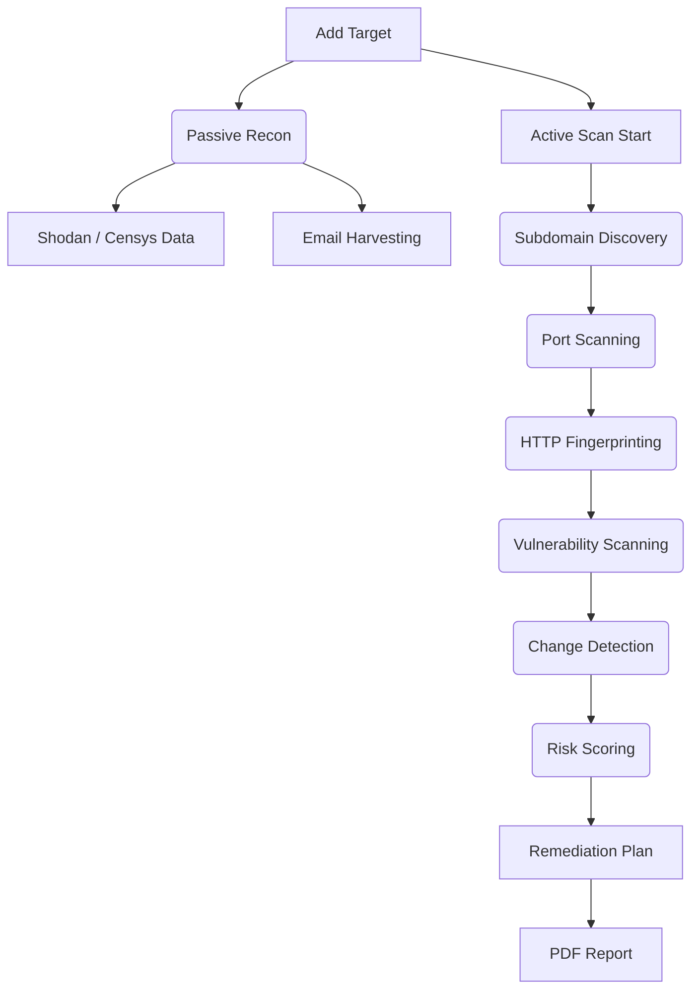

# EASM AEGIS: Master Project Guide

This document provides a comprehensive overview of the EASM (External Attack Surface Management) AEGIS project, serving as the definitive reference for its architecture, features, and current technical state.

---

## 🏗️ System Architecture

AEGIS follows a modular, layered architecture designed for scalability and asynchronous processing.

### 1. Unified Workflow (Data Flow)
The project follows a standard penetration testing methodology automated into a single pipeline:

### 2. Implementation Layers
- **UI Layer (`templates/`, `static/`)**: Vanilla JS + Bootstrap dashboard. Performs real-time polling for scan status.
- **Route Layer (`routes/`)**: Flask Blueprints acting as an API gateway.
- **Logic Layer (`core/`)**: The "brain" of the app. Orchestrates third-party binaries and processes raw results.
- **Data Layer (`database/`)**: MongoDB interface with strict sanitization (`utils/sanitize.py`) and deduplication logic.

---

## ✅ Feature List & Audit Status

| Feature Name | Primary Files Involved | Status |
| :--- | :--- | :--- |
| **Email Discovery** | `email_harvester.py`, `emails_db.py`, `emails.py` | ✅ WORKING |
| **Passive Recon** | `scanner.py`, `dashboard.py`, `dashboard.html` | ✅ WORKING |
| **Active Discovery** | `subfinder.py`, `naabu.py`, `httpx_runner.py` | ✅ WORKING |
| **Vulnerability Scanning** | `nuclei.py`, `vulns_db.py`, `vulns.py` | ✅ WORKING |
| **Remediation Engine** | `remediation_engine.py`, `remediation.html` | ✅ WORKING |
| **Change Detection** | `scanner.py`, `changes_db.py`, `changes.html` | ✅ WORKING |
| **PDF Reporting** | `pdf_generator.py`, `report_generator.py` | ✅ WORKING |
| **User Authentication** | `app.py`, `login.html` | ⚠️ PARTIAL |

> [!NOTE]
> **Authentication Status**: Current implementation is a simple session-based single-admin login. It is functional but lacks multi-user support or RBAC.

---

## 💀 Dead Code & Redundancy Inventory

The following files or functions were identified as unused or redundant:

1. **`tools/theHarvester/restfulHarvest.py`**: Leftover script, not called by the main harvester.
2. **`database/db.py`**: Redundant (Modular `_db.py` files are now preferred).
3. **`core/utils.py`** (if exists): Check if functions were migrated to `utils/`.

---

## 🔧 External Tools & APIs

AEGIS integrates the following external capabilities:

| Category | Tool / API | Integration Type |
| :--- | :--- | :--- |
| **Recon** | `subfinder.exe` | Subprocess Binary |
| **Scanning** | `naabu.exe`, `nuclei.exe` | Subprocess Binary |
| **Intelligence** | `Shodan`, `Censys` | REST API |
| **Email** | `Hunter.io`, `LeakCheck`, `IntelX` | REST API |
| **Knowledge** | `CISA KEV`, `CWE`, `EPSS` | Static JSON Data |

---

## 🔍 Debugging & Maintenance

- **Logs**: Located in `utils/logger.py` output. Check terminal for "Background harvest info".
- **Database**: Connect to `mongodb://localhost:27017` using MongoDB Compass.
- **API Health**: Access `/api/health` for connection status.
